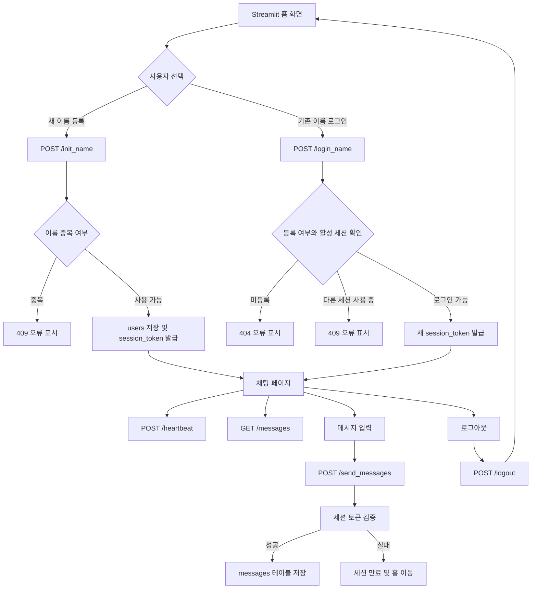

# Streamlit + FastAPI 채팅 프로토타입 발전 과정

> 초기 채팅 프로토타입에서 시작해 이름 관리, 페이지 이동, SQLite 저장, 중복 이름 방지, 세션 동시 접속 제한까지 발전한 과정을 시간순으로 정리한 문서입니다.
>
> 이 문서는 Notion에 그대로 붙여 넣거나 Markdown 파일로 import할 수 있습니다.

## 0. 최종 목표

처음 목표는 다음과 같은 구조의 채팅 앱을 만드는 것이었습니다.

- Streamlit: 사용자 화면과 채팅 UI
- FastAPI: 사용자 이름과 채팅 메시지 처리
- SQLite: 이름과 메시지의 영구 저장
- 여러 브라우저 세션에서 같은 채팅방 공유
- 동일한 이름의 동시 접속 제한
- 재접속 시 기존 이름으로 로그인

최종 구조는 다음과 같습니다.

```text
Streamlit
  |
  | HTTP 요청
  v
FastAPI
  |
  | sqlite3
  v
SQLite: database/chat.db
  |- users
  `- messages
```

---

## 1. 초기 프로토타입: 이름 입력과 채팅 입력을 한 파일에서 처리

### 문제 제기

초기 Streamlit 코드는 이름을 입력받고 곧바로 채팅 입력창을 보여주는 형태였습니다.

```python
st.title("Streamlit & FastAPI Chat Example")
global name

with st.form("add_user_name"):
    name = st.text_input("이름", value="홍길동")
    submit_button = st.form_submit_button("백엔드로 전송")

prompt = st.chat_input("Say something")
```

이때 제기된 문제는 다음과 같습니다.

- `global name`이 필요한가?
- 이름을 입력하지 않았을 때 채팅에 들어가지 못하게 할 수 있는가?
- 이름 입력 후 화면을 바꿀 수 있는가?
- FastAPI로 실제 데이터를 보내고 있는가?

### 원인 분석

`global`은 함수 내부에서 전역 변수를 수정할 때 사용하는 키워드입니다. 현재 코드는 파일 최상위에서 실행되므로 `global name`은 필요하지 않습니다.

또한 Streamlit은 사용자의 입력이나 버튼 클릭 때마다 스크립트를 다시 실행합니다. 단순 전역 변수보다 사용자 세션별 값을 보존하는 `st.session_state`가 적합합니다.

### 해결책: `st.session_state` 사용

```python
if "name" not in st.session_state:
    st.session_state.name = ""
```

이 코드는 현재 사용자의 세션에 `name`이라는 값을 만들고, 이후 rerun이 발생해도 이름을 유지합니다.

이름 입력 검사는 다음과 같이 작성할 수 있습니다.

```python
if submit_button:
    if name.strip():
        st.session_state.name = name.strip()
    else:
        st.error("이름을 입력해 주세요.")
```

`strip()`은 공백만 입력한 경우를 빈 이름으로 처리하기 위한 것입니다.

---

## 2. 페이지 이동 요구: 이름 입력 후 채팅 화면으로 이동

### 문제 제기

이름을 입력한 뒤 같은 화면에서 조건문으로 채팅창을 보여주는 것보다, 다음처럼 화면을 분리하고 싶었습니다.

```text
이름 입력 페이지
      |
      | 이름 입력 성공
      v
채팅 페이지
```

### 첫 번째 해결 시도

Streamlit의 페이지 이동 기능을 사용했습니다.

```python
st.session_state.name = name.strip()
st.switch_page("pages/chat.py")
```

그러나 다음 오류가 발생했습니다.

```text
StreamlitPageNotFoundError
```

### 원인

Streamlit이 실행한 엔트리포인트와 `pages` 디렉터리를 인식하는 방식이 현재 실행 구조와 맞지 않았습니다. 파일이 실제로 존재하더라도 Streamlit의 페이지 목록에 등록되지 않으면 `switch_page()`가 찾지 못할 수 있습니다.

### 최종 해결책: 명시적 페이지 등록

`app.py`에서 페이지를 직접 등록했습니다.

```python
home_page = st.Page("pages/home.py", title="이름 입력", default=True)
chat_page = st.Page("pages/chat.py", title="채팅")

navigation = st.navigation([home_page, chat_page], position="hidden")
navigation.run()
```

화면은 다음처럼 분리되었습니다.

```text
proj_streamlit/
  app.py
  pages/
    home.py
    chat.py
```

이름 입력 페이지에서는 다음과 같이 이동합니다.

```python
st.session_state.name = name.strip()
st.switch_page("pages/chat.py")
```

채팅 페이지에서 이름이 없으면 다시 홈으로 보냅니다.

```python
if "name" not in st.session_state or not st.session_state.name:
    st.switch_page("pages/home.py")
```

### 코드 해석

- `st.Page`: Streamlit 페이지 정의
- `st.navigation`: 앱에서 사용할 페이지 목록 등록
- `st.switch_page`: 현재 세션을 다른 페이지로 이동
- `position="hidden"`: 기본 네비게이션 메뉴를 숨김

---

## 3. FastAPI 실행 구조와 SQLite 경로 정리

### 문제 제기

FastAPI 실행 명령과 Streamlit 실행 명령을 확인했습니다.

```bash
uvicorn main:app --reload
streamlit run app.py
```

또한 SQLite 파일을 다음 경로에 두고 싶었습니다.

```text
proj_fastapi/database/chat.db
```

### 잘못된 경로

```python
CHAT_DB_PATH = Path(__file__).with_name("databasechat.db")
```

`with_name()`은 폴더를 생성하지 않습니다. 위 코드는 `databasechat.db`라는 파일을 `main.py`와 같은 폴더에 만드는 의미입니다.

### 해결책

```python
DATABASE_DIR = Path(__file__).parent / "database"
DATABASE_DIR.mkdir(exist_ok=True)
CHAT_DB_PATH = DATABASE_DIR / "chat.db"
```

### 코드 해석

- `Path(__file__).parent`: 현재 `main.py`가 있는 폴더
- `/ "database"`: 현재 폴더 아래의 `database` 폴더
- `mkdir(exist_ok=True)`: 폴더가 없으면 생성
- `/ "chat.db"`: 최종 SQLite 파일 경로

실제 경로는 다음과 같습니다.

```text
20260910/streamlit_fastapi_chat_proj/proj_fastapi/database/chat.db
```

---

## 4. 메시지 데이터베이스 설계

### 문제 제기

채팅 메시지에 다음 세 가지 정보를 저장하고 싶었습니다.

- 사용자 이름
- 메시지 내용
- 날짜와 시간

### 테이블 설계

메시지마다 하나의 행을 만들도록 `messages` 테이블을 구성했습니다.

```sql
CREATE TABLE IF NOT EXISTS messages (
    id INTEGER PRIMARY KEY AUTOINCREMENT,
    name TEXT NOT NULL,
    message TEXT NOT NULL,
    created_at TEXT NOT NULL DEFAULT CURRENT_TIMESTAMP
)
```

### 컬럼 해석

| 컬럼 | 의미 |
|---|---|
| `id` | 메시지 고유 번호 |
| `name` | 메시지를 보낸 사용자 이름 |
| `message` | 메시지 내용 |
| `created_at` | 저장 날짜와 시간 |

`CURRENT_TIMESTAMP`는 SQLite가 INSERT 시 자동으로 시간을 입력합니다. 기본값은 UTC입니다.

### 메시지 저장 API

```python
class MessageRequest(BaseModel):
    name: str
    message: str
    session_token: str
```

```python
@app.post("/send_messages")
def send_messages(request: MessageRequest):
    # 세션 검증 후 메시지 INSERT
    ...
```

Streamlit 요청 데이터는 다음 형태입니다.

```json
{
  "name": "홍길동",
  "message": "안녕하세요",
  "session_token": "발급받은 토큰"
}
```

### 메시지 조회 API

```python
@app.get("/messages")
def get_messages():
    ...
```

다른 브라우저 세션의 채팅도 공유하려면 Streamlit이 자신의 로컬 목록만 보여주면 안 됩니다. 채팅 페이지가 백엔드에서 전체 메시지를 다시 조회해야 합니다.

```python
messages_response = requests.get(f"{FASTAPI_URL}/messages")
if messages_response.ok:
    st.session_state.messages = messages_response.json()
```

### 공유가 늦게 보였던 이유

초기에는 다음 값만 화면에 그렸습니다.

```python
st.session_state.messages
```

`st.session_state`는 브라우저 세션별 저장 공간이므로 다른 브라우저의 메시지를 알 수 없습니다.

현재는 매번 `/messages`를 호출하므로 메시지가 DB를 기준으로 공유됩니다. 다만 별도의 자동 새로고침이 없으면 다른 세션에서 보낸 메시지는 새로고침이나 메시지 전송 후에 화면에 나타납니다.

---

## 5. username 중복 방지

### 문제 제기

같은 이름을 여러 사용자가 등록할 수 있었습니다.

```text
홍길동 등록
홍길동 등록
홍길동 등록
```

### 해결책: `users` 테이블과 UNIQUE 제약

```sql
CREATE TABLE IF NOT EXISTS users (
    id INTEGER PRIMARY KEY AUTOINCREMENT,
    username TEXT NOT NULL UNIQUE COLLATE NOCASE,
    session_token TEXT,
    last_seen TEXT,
    created_at TEXT NOT NULL DEFAULT CURRENT_TIMESTAMP
)
```

### 코드 해석

- `username UNIQUE`: 같은 이름을 두 번 저장할 수 없음
- `COLLATE NOCASE`: `Hong`과 `hong`을 같은 이름으로 취급
- `id`: 내부 사용자 식별자
- `created_at`: 사용자 등록 시간

새 이름 등록 시:

```python
@app.post("/init_name")
def init_name(request: NameRequest):
    name = request.name.strip()
    ...
    INSERT INTO users ...
```

이미 존재하는 이름이면 SQLite의 `IntegrityError`를 FastAPI의 `409 Conflict`로 변환합니다.

```python
except sqlite3.IntegrityError:
    raise HTTPException(
        status_code=409,
        detail="이미 사용 중인 이름입니다.",
    )
```

---

## 6. 기존 username으로 재접속

### 문제 제기

username을 UNIQUE로 만들면 기존 사용자가 재접속할 때도 중복 오류가 발생합니다.

```text
기존 이름 입력
  -> 이미 사용 중인 이름
  -> 로그인 불가
```

### 해결책: 등록과 로그인을 API로 분리

새 사용자 등록:

```http
POST /init_name
```

기존 사용자 로그인:

```http
POST /login_name
```

로그인 API는 `users` 테이블에서 이름을 조회합니다.

```python
@app.post("/login_name")
def login_name(request: NameRequest):
    row = chat_db_connection.execute(
        "SELECT username FROM users WHERE username = ?",
        (name,),
    ).fetchone()
```

이름이 있으면 로그인 성공, 없으면 `404 Not Found`를 반환합니다.

Streamlit에서는 두 버튼을 분리했습니다.

```python
register_button = st.form_submit_button("새 이름 등록")
login_button = st.form_submit_button("기존 이름 로그인")
```

로그인 성공 시 사용자 이름과 세션 토큰을 Streamlit 세션에 저장합니다.

```python
st.session_state.name = response.json()["name"]
st.session_state.session_token = response.json()["session_token"]
```

---

## 7. 동일 username의 여러 세션 동시 접속 제한

### 문제 제기

이름만으로 로그인하면 다음 상황이 가능했습니다.

```text
브라우저 A: 홍길동 로그인 성공
브라우저 B: 홍길동 로그인 성공
브라우저 C: 홍길동 로그인 성공
```

이름은 사용자 식별자가 아니라 단순 문자열이므로, 현재 세션이 실제로 어떤 브라우저인지 구분할 수 없었습니다.

### 해결책: 활성 세션 토큰

로그인할 때 FastAPI가 랜덤 토큰을 발급합니다.

```python
session_token = secrets.token_urlsafe(32)
```

이 토큰을 `users.session_token`에 저장하고, Streamlit의 `st.session_state`에도 저장합니다.

```python
st.session_state.session_token = response.json()["session_token"]
```

이후 메시지 전송 시 토큰을 함께 보냅니다.

```python
json={
    "name": st.session_state.name,
    "message": prompt,
    "session_token": st.session_state.session_token,
}
```

FastAPI는 이름과 토큰이 일치하는지 검사합니다.

```python
UPDATE users
SET last_seen = CURRENT_TIMESTAMP
WHERE username = ?
  AND session_token = ?
  AND last_seen > datetime('now', '-5 minutes')
```

### 중복 로그인 차단

로그인 시 이미 최근 5분 내 활동한 세션 토큰이 있으면 차단합니다.

```python
if active_session:
    raise HTTPException(
        status_code=409,
        detail="이미 다른 세션에서 사용 중인 이름입니다.",
    )
```

### 세션 만료

브라우저가 비정상적으로 종료되면 로그아웃 API가 호출되지 않을 수 있습니다. 그래서 `last_seen` 기준으로 5분 동안 활동이 없으면 만료된 세션으로 처리합니다.

```text
정상 로그아웃: 즉시 다른 세션 로그인 가능
비정상 종료: 최대 5분 후 다른 세션 로그인 가능
```

### heartbeat

채팅 페이지에 진입할 때 현재 세션을 갱신합니다.

```python
heartbeat_response = requests.post(
    f"{FASTAPI_URL}/heartbeat",
    json=session_data,
)
```

세션이 만료되었거나 다른 세션이 토큰을 가져간 경우에는 홈 화면으로 돌려보냅니다.

### 로그아웃

```python
if st.sidebar.button("로그아웃"):
    requests.post(f"{FASTAPI_URL}/logout", json=session_data)
    st.session_state.clear()
    st.switch_page("pages/home.py")
```

FastAPI에서는 토큰을 삭제합니다.

```python
UPDATE users
SET session_token = NULL,
    last_seen = NULL
WHERE username = ?
  AND session_token = ?
```

---

## 8. 현재 전체 동작 순서



---

## 9. 현재 프로젝트 파일 구조

```text
20260910/streamlit_fastapi_chat_proj/
  proj_fastapi/
    main.py
    database/
      chat.db
  proj_streamlit/
    app.py
    pages/
      home.py
      chat.py
```

### 실행 명령

FastAPI 터미널:

```bash
cd 20260910/streamlit_fastapi_chat_proj/proj_fastapi
uvicorn main:app --reload
```

Streamlit 터미널:

```bash
cd 20260910/streamlit_fastapi_chat_proj/proj_streamlit
streamlit run app.py
```

---

## 10. 현재 해결된 문제와 남은 한계

### 해결된 문제

- 이름 미입력 상태로 채팅 화면에 들어가는 문제
- `global name`의 불필요한 사용
- 이름 입력 후 페이지 이동
- `st.switch_page()`가 페이지를 찾지 못하는 문제
- SQLite 파일 경로 문제
- 메시지의 이름, 내용, 저장 시간 기록
- 서로 다른 세션 간 메시지 공유
- username 중복 등록
- 기존 username 재로그인
- 동일 username의 동시 세션 접속
- 비정상 종료 세션의 영구 잠금 문제

### 남은 한계

1. 현재 로그인은 비밀번호 없이 username만 사용합니다.
   - 이름을 알고 있으면 다른 사람이 로그인할 수 있습니다.
   - 실제 서비스에서는 비밀번호, 이메일 인증, OAuth 등이 필요합니다.

2. 채팅 자동 갱신이 없습니다.
   - 다른 사용자의 메시지는 현재 화면에서 새로고침하거나 메시지를 보낼 때 나타납니다.
   - 자동 갱신을 원하면 Streamlit 주기적 rerun, WebSocket, SSE 등을 고려할 수 있습니다.

3. SQLite는 단일 서버의 작은 프로토타입에 적합합니다.
   - 사용자가 많아지면 PostgreSQL 같은 서버형 DB를 고려해야 합니다.

4. 메시지 테이블이 사용자 이름 문자열을 직접 저장합니다.
   - 규모가 커지면 `messages.user_id`를 두고 `users.id`와 외래키로 연결하는 구조가 더 좋습니다.

5. 세션 만료 시간 5분은 고정값입니다.
   - 서비스 특성에 따라 조정하거나 환경 변수로 분리할 수 있습니다.

---

## 11. 발전 과정 한 줄 요약

```text
단순 입력 화면
-> session_state 적용
-> 페이지 분리
-> SQLite 경로 정리
-> messages 테이블 추가
-> DB 기반 메시지 공유
-> users 테이블과 UNIQUE 이름
-> 기존 이름 로그인
-> session_token 기반 동시 접속 제한
-> heartbeat와 logout으로 세션 관리
```
